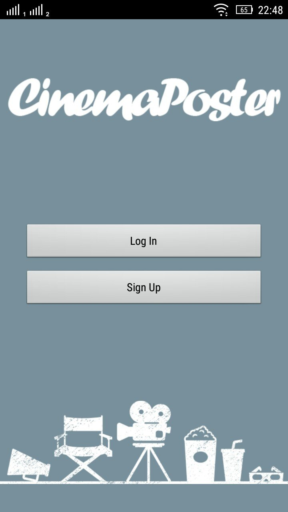
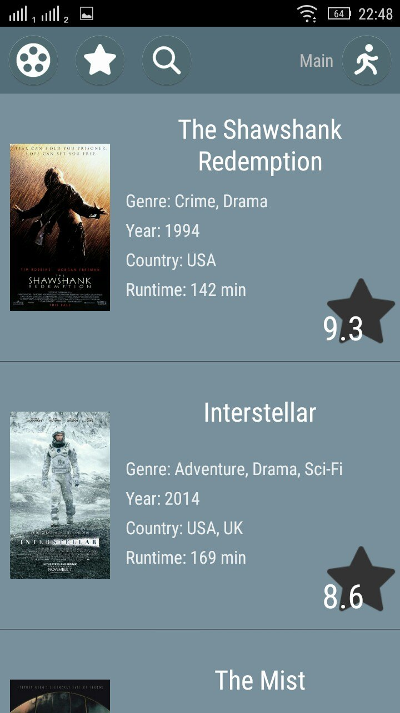
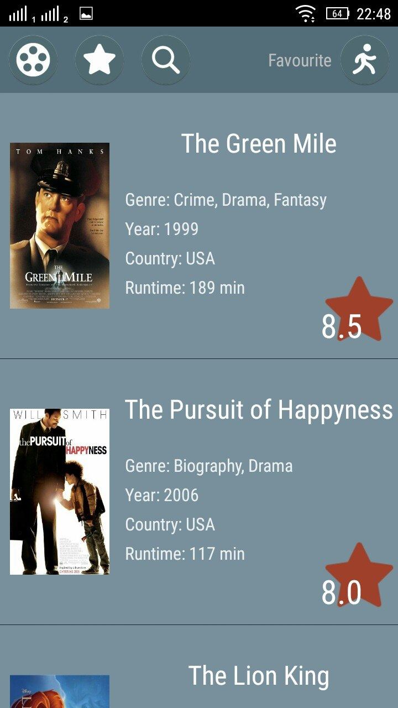

# CinemaPoster

=========

## Overview

Project CinemaPoster is my simple REST-client which uses [omdbapi api](http://www.omdbapi.com/).

At first you must sign up.

You can show posters and add they to your favourite posters. Your favourite posters is connected with your account.

Also you can search all film’s information.

